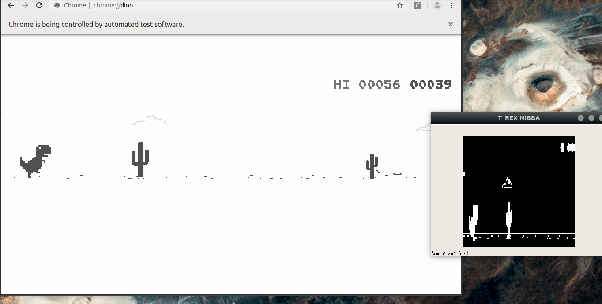

# Reinforcement Learning -AI GameBot for T-Rex Game

**Game Bot for playing T-Rex Game developed on Reinforcement Learning Algorithm. (Deep Q learning)**

## Dependencies
- Python Python 2.7.1
- Pytorch 0.4.0
- Selenium   3.13.0

## How to RUN:
- Run 
   >python model.py test
   
   
   to run the pre-trained neural network model.
- Run 
   >python model.py train 

   to train the model from the beginning.

## Credits:
- Neven Pičuljan [Git Repo](https://github.com/nevenp/dqn_flappy_bird)

- Ravi Munde [MIT License](https://github.com/Paperspace/DinoRunTutorial/blob/master/LICENSE)
  Copyright (c) 2018 Ravi Munde 
  
- [Pytorch Tutorial](https://pytorch.org/tutorials/intermediate/reinforcement_q_learning.html)

- [David Silva -RL](http://www0.cs.ucl.ac.uk/staff/d.silver/web/Teaching.html)

## License:
MIT License
Copyright (c) 2019 Aryan Chaudhary
[MIT](https://github.com/aryanc55/T-RexDinoRunner-GAME-AI-BOT/blob/master/LICENSE)

